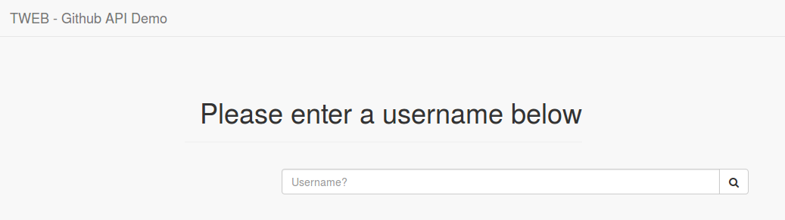
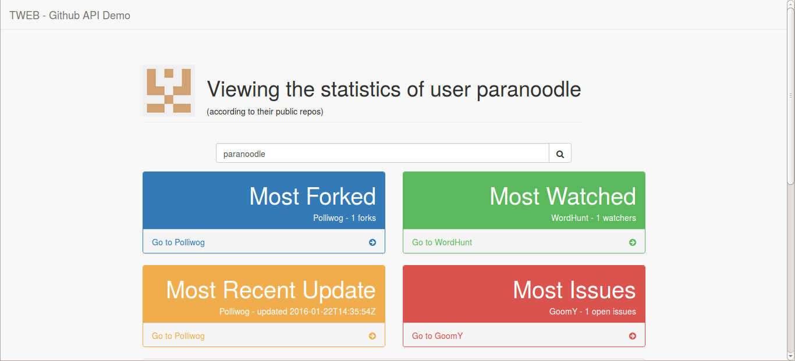
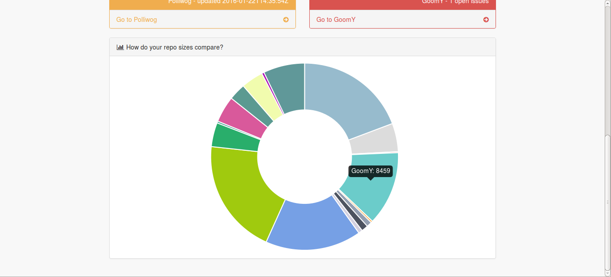

# TWEB-TE2
## TWEB - Github API Demo

by Eléonore d'Agostino

## Links

[**Heroku**](https://tweb-te2-dagostino.herokuapp.com/)

## Intro

I decided to use the GitHub API, mainly because it was the only API name I recognized out of the list (and I preferred to work with something I was more familiar with, if possible), and I didn't really have any ideas as to how to illustrate CORS well.

## Setting up

I originally decided to use the `angular` generator, despite never having used it before, since it seemed to be the simplest base for an AngularJS application. After over an hour of errors all over the Heroku logs, I went back to the `Express` generator, which I'd used for a previous exercise and felt a *little* more comfortable with. Once I had the example page pushed to Heroku and working, I started on the code proper.

## Libraries used

* Node.js with the [Express framework](http://expressjs.com/)
* [AngularJS](https://angularjs.org/)
* [Chart.js](http://www.chartjs.org/), with [angular-chart.js](http://jtblin.github.io/angular-chart.js/) for Angular compatibility
* [Bootstrap](http://getbootstrap.com/) for templates
* [Jade](http://jade-lang.com/) template engine instead of pure HTML
* [GitHub API](https://developer.github.com/v3/), with the [github wrapper](https://github.com/michael/github)

## Features

* Pages were written in Jade instead of HTML, and the layout was therefore converted (and adapted) from an HTML Bootstrap theme.
* Uses of Angular:
  * `ng-show` to only show some of the components once they have a reason to be there
  * `ng-if` to wait until the correct data has been fetched before displaying it (using `ng-show` instead of this with chart.js leads to strange glitches)
  * `ng-model` to handle input and fetching of data without refreshing the page
  * Custom controller to fetch user and repo data from GitHub and format it for use with jade
  * No reloading!
* Displays fun statistics about a user's repos!

## Overview

Opening the heroku app leads to a simple landing page asking for a username:

[](images/landing.png)

After having entered one, the page displays this user's most forked, watched, recently updated, and issue-prone public repositories. Since we use a wrapper for the GitHub API, the calls are very simple:

```
var github = new Github({
    token: "199455c3dd5f97e1ee599e202a41880602a683cb",
    auth: "oauth"
  });
```

We create an instance of our wrapper by using a personal access token, then use that to obtain user information, from the username we retrieved via Angular:

```
var user = github.getUser();
user.show(username, function(err, user) { ... });
user.userRepos(username, function(err, repos) { ... });
```

The statistics on the repositories are then done via simple array manipulations involving maps:

```
var max_fork_val = Math.max.apply(Math, repos.map(function(r){return r.forks_count}));
var max_fork_obj = repos.find(function(o){return o.forks_count == max_fork_val});
```

[](images/repo_best_of.png)

In order not to leave behind the less *special* repositories, the page also displays a neat little chart to let the viewer get an idea of the repositories' sizes compared to each other, again using maps:

[](images/repo_sizes.png)

## Difficulties

* **Making anything work on heroku**  
I know in theory how it works, but in practice getting a successful deployment takes several commits and lots of swearing. In practice it also means pushing the components folder when I *really* shouldn't.
* **GitHub's spelling**  
I spent over half an hour trying to figure out why the GitHub API wrapper was not working, before I realized that the object they use is in fact spelled "Github" and not "GitHub". Which is *wrong*.
* **Chart.js and ng-show**  
As it turns out, using `angular-chart.js` with `ng-show` leads to a strange yet amusing glitch where the canvas containing the chart would fail to erase the previous chart if two usernames were entered back-to-back without refreshing the page. This would cause flickering and visual glitches while hovering over the chart, as the canvas would try to apply the hover functions of both charts at the same time.

## Known Issues

* Not an issue so much as a... *wrong* implementation, but due to issues with getting heroku to tell me where it hid the npm components files (after downloading and installing them successfully from [`package.json`](package.json), I went for the subtle solution of pushing the entire components folder to the repository. So, *technically*, it works fine, but it's incorrect.

## Conclusion

I'm fairly happy with the result given how little time I ended up being able to use to work on this (which, even after factoring in sacrificed sleep hours, was *not that much*), which I guess is a good sign, since I had relatively little trouble with the Angular side of things.
